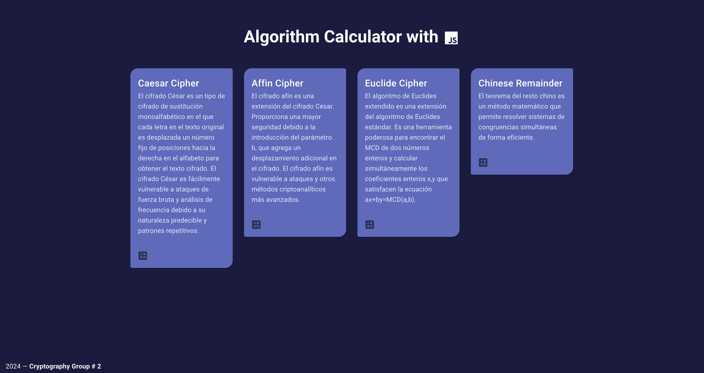

<h1 align="center">
  Proyecto Criptografía
</h1>

Proyecto para la materia criptografía con el objetivo de integrar los algoritmos dados en clases en un sistema computacional, el cual será un sistema web.

Para ver la demostración del Sistema Web, dar clic <a href="https://cryptography-group2.netlify.app/">aquí.</a>

# Descripción
Sistema web que presenta los algoritmos dados en clases, los cuales son:

1. Algoritmo de César o Caesar Cipher.
2. Algoritmo Afín o Affine Cipher.
3. Algoritmo de Euclides o Euclidean Cipher.
4. Teorema Chino del Residuo o Chinese Remainder Theorem.

# Acerca del proyecto

### Dependencias
Si se desea bajar el repositorio y correrlo de manera local, se necesita instalar Node.js, la versión 16.

### Ejecución del programa
Para la ejecución del programa, se abre el archivo index.html en el navegador de preferencia. Se recomienda el navegador Google Chrome.

# Autores
* Vicente Arreaga - vicearre@espol.edu.ec
* Andrea Cáceres - alcacere@espol.edu.ec
* Milton García - mfgarcia@espol.edu.ec

 
<footer>

<b>
ESPOL - FIEC - Cohorte X 2023|2024 — Cryptography Group # 2
</b></footer>